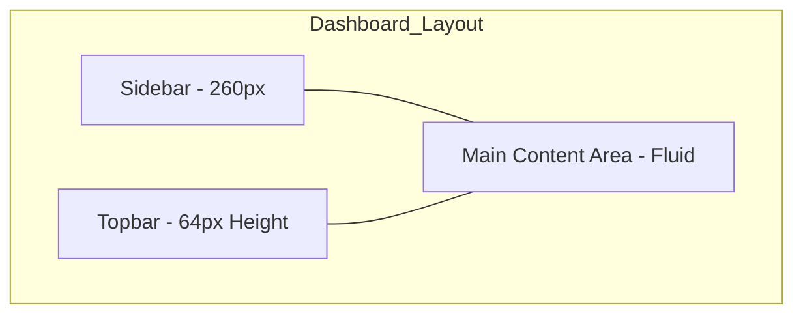
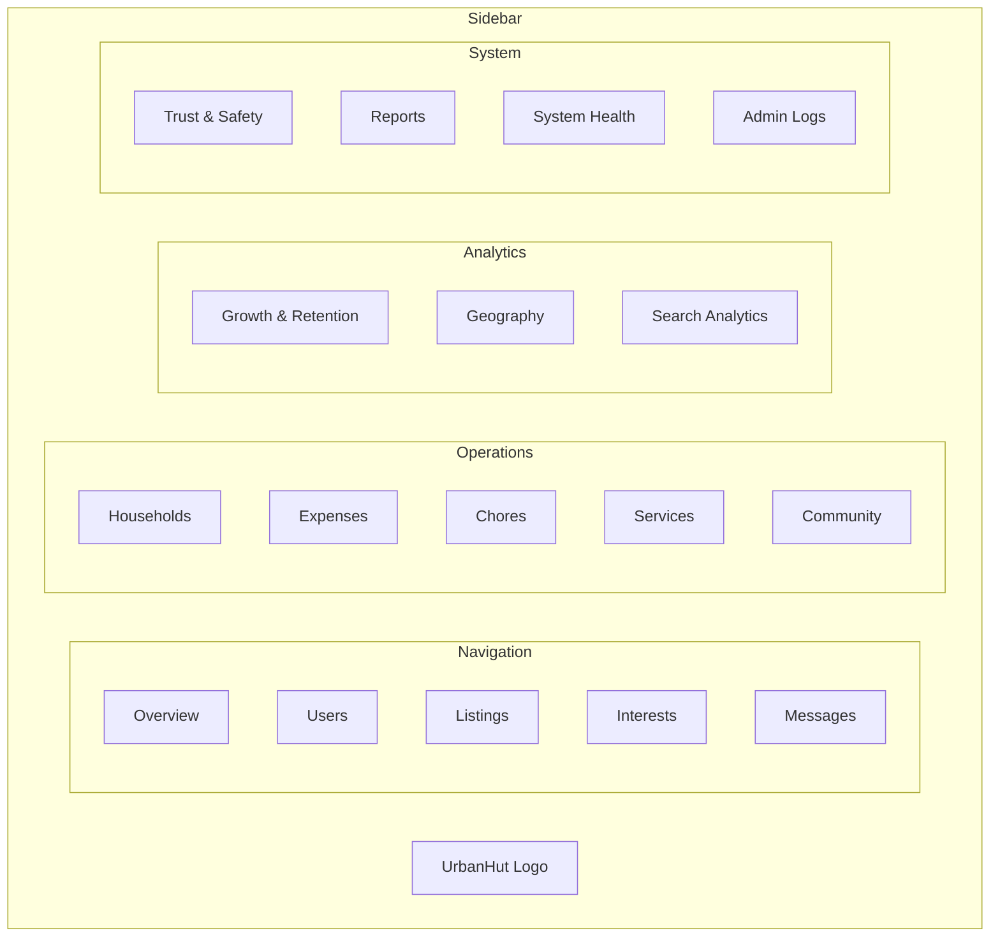

# Admin Dashboard Wireframes

This document outlines the wireframe structures for the UrbanHut Admin Dashboard.

## Implementation Status
- [x] Phase 1: Executive Overview (Row 1 & 2 KPIs, Growth Chart, Recent Activity)
- [x] Phase 2: Product Analytics (Funnels, Retention, Search Analytics)
- [x] Phase 3: Operations & Trust (Trust Score Distribution, Verification Stats, Household Adoption)

## 1. Global Layout Structure

The dashboard follows a standard "Sidebar + Topbar + Content" layout.



---

## 2. Sidebar Navigation (Wireframe)

The sidebar is divided into logical sections as per the URB-69 metrics plan.



---

## 3. Executive Overview Dashboard (Wireframe)

The "Daily Admin Home Page" wireframe based on Section 26 of URB-69.

### 3.1 Top KPI Cards (Row 1)
- **New Users Today** (Metric + Trend)
- **DAU** (Daily Active Users)
- **Active Listings**
- **Listing Views**
- **Interests Sent**

### 3.2 Top KPI Cards (Row 2)
- **Messages Sent**
- **Households Active**
- **Chores Completed**
- **Expenses Created**
- **Avg Session Time**

### 3.3 Middle Row (Data Visualizations)
- **User Growth Chart** (Line)
- **Feature Usage Chart** (Bar)
- **Listing Funnel** (Funnel Chart)
- **City Heatmap** (Map)

### 3.4 Bottom Row (Activity & Queues)
- **Recent Users Table** (Name, Role, Status, Joined)
- **Recent Listings Table** (Title, Owner, City, Price)
- **Pending Approvals Queue** (Verifications, New Listings)
- **Reported Issues** (Reported Users/Posts)

---

## 4. Funnel Analytics Dashboard (Wireframe)

Based on Section 19 of URB-69. Focuses on user journey drop-offs.

### 4.1 Onboarding Funnel (Visual)
- App Opened -> Signup Started -> Signup Completed -> Profile Finished -> Verified

### 4.2 Marketplace Funnels
- **Seeker:** Search -> View -> Interest -> Message -> Accepted
- **Owner:** Create -> Publish -> Receive Interest -> Accept Tenant

---

## 5. Retention Dashboard (Wireframe)

Based on Section 18 of URB-69.

### 5.1 Retention Metrics
- D1 Retention, D7 Retention, D30 Retention, Stickiness (DAU/MAU)

### 5.2 Cohort Retention Table
| Cohort | Size | Day 0 | Day 1 | Day 7 | Day 30 |
| :--- | :--- | :--- | :--- | :--- | :--- |
| Apr 01 | 1,200 | 100% | 45% | 22% | 12% |
| Apr 08 | 1,450 | 100% | 48% | 24% | - |

---

## 6. Search & Filter Analytics (Wireframe)

Based on Section 17 of URB-69.

### 6.1 Top Searched Cities (Bar Chart)
1. New York
2. London
3. San Francisco
4. Berlin

### 6.2 Filter Usage Distribution (Pie Chart)
- Price Range (45%)
- Room Type (25%)
- Pets Allowed (15%)
- Amenities (15%)

---

## 7. Trust & Verification Analytics (Wireframe)

Based on Section 14 & 15 of URB-69.

### 7.1 Trust Score Distribution (Histogram)
- 0-20 (Low)
- 21-40 (Fair)
- 41-60 (Good)
- 61-80 (Trusted)
- 81-100 (Highly Trusted)

### 7.2 Verification Funnel
- Document Uploaded -> Pending Review -> Approved/Rejected

---

## 8. Household Analytics (Wireframe)

Based on Section 9 of URB-69.

### 8.1 Household Engagement
- **Total Households:** [Metric]
- **Active Households:** [Metric]
- **Avg Members per Household:** [Metric]

### 8.2 Feature Adoption (Bar Chart)
- Expenses Enabled
- Chores Enabled
- Services Used

---

## 9. Component Wireframe: Metric KPI Card

```text
+---------------------------------------+
|  Total Users              [Icon: Users] |
|                                       |
|  45,284                               |
|                                       |
|  [Arrow Up] 5.2% vs last month        |
+---------------------------------------+
```

## 5. Component Wireframe: Sidebar Item

```text
+---------------------------------------+
| [Icon]  Overview                      |
+---------------------------------------+ (Normal)

+---------------------------------------+
| [Icon]  Users                         | <--- Active (Slate 700 Bg)
+---------------------------------------+
```
