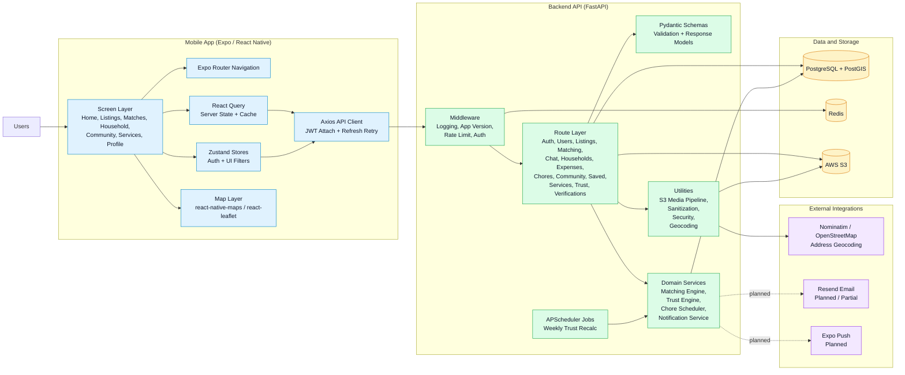

# Urban Hut Architecture Diagram

This diagram is intentionally stored as editable Mermaid text.

You can edit it in:

- this Markdown file directly
- Mermaid Live Editor
- GitHub / GitLab Mermaid previews
- IDEs with Mermaid support

## System Architecture

## Reading Notes

- The mobile app is built around Expo Router for navigation, React Query for remote data, Zustand for lightweight local state, and Axios for authenticated API calls.
- The FastAPI backend is organized by route modules and backed by Pydantic schemas, SQLAlchemy models, and domain services.
- PostgreSQL is the source of truth, Redis supports rate limiting, and S3 is used for image/document storage.
- Geocoding currently uses OpenStreetMap Nominatim.
- Notification integrations are architected but still partial compared with the rest of the system.

## Suggested Future Diagram Splits

If you want more detailed editable diagrams later, the next best breakdown is:

1. Auth and session lifecycle
2. Listing and matching lifecycle
3. Household, expenses, and chores domain
4. Trust and verification engine
5. Media upload and storage pipeline
