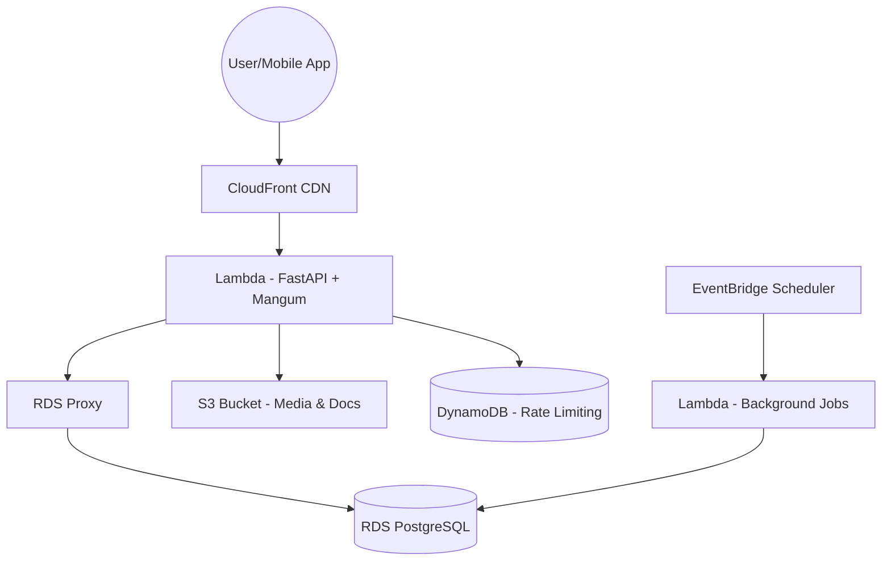

# AWS Free Tier Cost-Optimized Hosting Analysis (URB-47)

## 1. Executive Summary
UrbanHut can be hosted on AWS at **$0/month** for the first 12 months (Free Tier) and remain near-zero cost indefinitely by leveraging serverless architecture. This analysis recommends a **Serverless-first approach** using AWS Lambda and RDS PostgreSQL to maximize scalability while minimizing idle costs.

---

## 2. Recommended Hosting Architecture (Serverless-first)

### Component Breakdown
| Service | Purpose | Free Tier Limit | Plan |
| :--- | :--- | :--- | :--- |
| **AWS Lambda** | API & Background Tasks | 1M requests/mo | Host FastAPI via Mangum. Use EventBridge for CRON. |
| **RDS Proxy** | DB Connection Pooling | Free with db.t3.micro | **Mandatory** to prevent connection exhaustion from Lambda. |
| **Amazon RDS** | Primary Database | 750 hrs/mo (db.t3.micro) | PostgreSQL 16. |
| **Amazon S3** | Image/Doc Storage | 5GB Storage | Store avatars, listing photos, and verification docs. |
| **Amazon CloudFront** | CDN & Security | 1TB Data Transfer Out | Cache static assets and protect API endpoints. |
| **DynamoDB** | Rate Limiting / Cache | 25GB Storage / 25 WCU/RCU | Replace Redis for rate-limiting to ensure perpetual $0 cost. |

---

## 3. Cost-Free Strategy ($0 Target)

*   **Compute ($0)**: Lambda only charges for execution time. With 400,000 GB-seconds free, the API will remain free for ~33,000 requests/day at 512MB RAM.
*   **Database ($0)**: Use the **db.t3.micro** instance. **CAUTION**: RDS Free Tier expires after 12 months. After 1 year, switching to Aurora Serverless v2 or a single t3.micro EC2 for DB + API may be necessary to keep costs low.
*   **Storage ($0)**: S3 is free up to 5GB. We will implement auto-cleanup for temporary uploads and compress images (Pillow) before storage.
*   **Networking ($0)**: Use CloudFront for all egress to leverage the 1TB free tier.
*   **Public IP ($0)**: By using Lambda instead of a dedicated EC2 instance, we avoid the **$0.005/hour ($3.60/month) IPv4 address charge**.

---

## 4. User Capacity Estimation

### Assumptions
*   **Average User Session**: 15 API calls.
*   **Peak Traffic Factor**: 3x average traffic.
*   **Average Request Latency**: 200ms at 512MB RAM.

### Daily Capacity
*   **Lambda Limit**: 1,000,000 requests / 30 days = **~33,333 requests/day**.
*   **User Support**: 33,333 / 15 calls = **~2,200 Daily Active Users (DAU)**.
*   **RDS Limit**: `db.t3.micro` + **RDS Proxy** allows for efficient connection reuse, supporting **~1,000-2,000 concurrent users** under light workload.

---

## 5. Risk Areas & Mitigations (CTO Refined)

| Risk | Impact | Mitigation |
| :--- | :--- | :--- |
| **RDS 12-Month Expiry** | ~$240/year cost after year 1. | Schedule migration to Aurora Serverless v2 or EC2-Postgres by Month 10. |
| **DB Connection Exhaustion**| API 500 errors. | **Mandate RDS Proxy** to manage pools across Lambda scaling. |
| **VPC NAT Gateway Cost** | ~$32/month (NOT FREE). | Place Lambda & RDS in the same VPC. Use VPC Endpoints for S3/DynamoDB. |
| **Security Exposure** | DB in public subnet. | Use Security Groups to restrict RDS access strictly to the Lambda's SG ID. |
| **Cold Starts** | 1-2s delay for first request. | Use EventBridge keep-warm pings. |

---

## 6. Scaling Plan (Beyond Free Tier)

1.  **Phase 1 (0-1k users)**: Pure Free Tier (Lambda + RDS t3.micro + RDS Proxy).
2.  **Phase 2 (1k-10k users)**: Keep Lambda; upgrade RDS to `db.t3.small` or Aurora Serverless v2.
3.  **Phase 3 (10k+ users)**: Introduce Elasticache (Redis) only if DynamoDB performance becomes a bottleneck for hot data.

---

## 7. Immediate Next Steps (Priority Order)
1.  **Port Rate Limiter**: Modify `RateLimitMiddleware` to use DynamoDB TTL-based counters (Removes Redis dependency).
2.  **Infra-as-Code**: Create AWS SAM / Terraform template with VPC, Security Groups (SG-ID based), and RDS Proxy.
3.  **Billing Alerts**: Set up CloudWatch billing alarms at $0.01 threshold.
