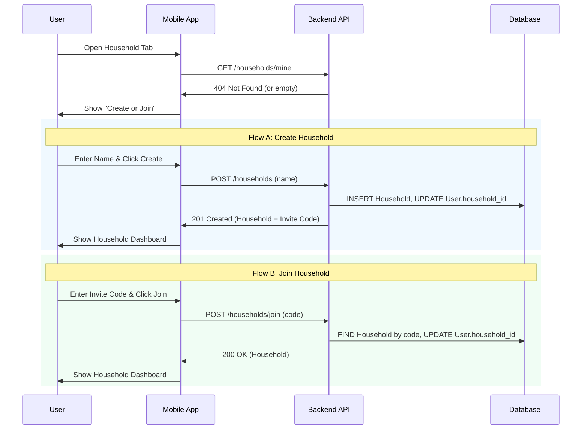
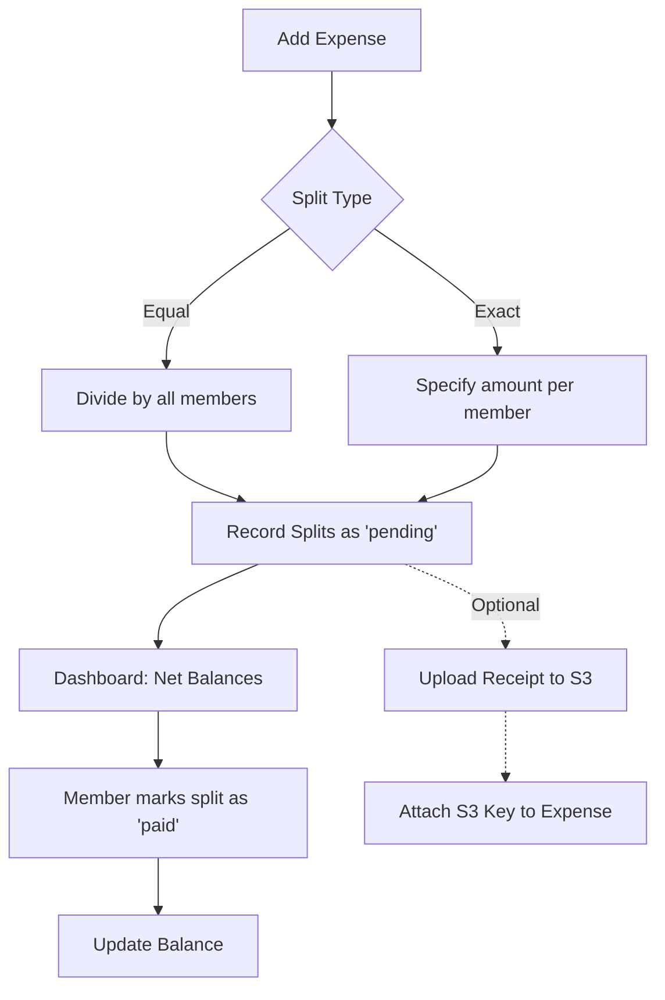
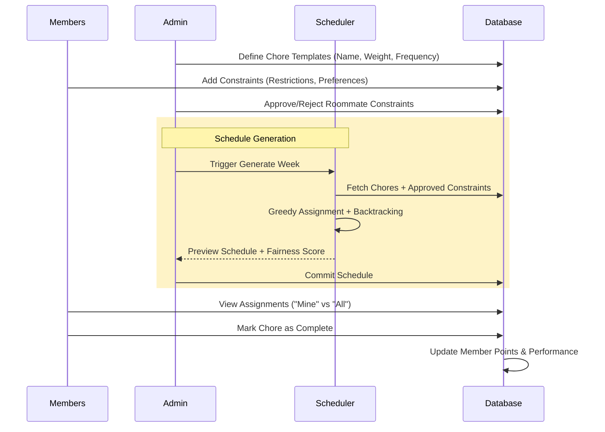

# Household Module Finalized UX Flows

This document details the finalized user experience flows for the Household module in Urban Hut, covering Expenses, Chores, and general Household management.

## 1. Household Lifecycle

Members can either create a new household or join an existing one using an invite code.

## 2. Shared Expenses Flow

Tracking shared bills, splitting costs, and settling debts.

### Expense States
- **Created**: Expense recorded by a payer.
- **Split**: Logic applied to determine who owes what.
- **Pending**: Splits are visible to members but not yet paid.
- **Paid**: Member has marked their specific split as settled.
- **Archived**: (Future) Historical view after all splits are paid.

## 3. Chore Management Flow

Fair distribution of household labor using a constraint-satisfaction scheduler.

### Chore Constraint Types
- **Fixed Assignment**: "I always do the laundry on Sundays."
- **Restriction**: "I cannot do trash on Wednesdays (work late)."
- **Preference**: "I prefer cooking over cleaning."
- **Frequency Cap**: "Max 2 bathroom cleanings per month."

## 4. Points and Trust Integration

The Household module feeds directly into the Urban Hut Trust Engine.

| Action | Trust Impact |
| :--- | :--- |
| Complete Chore | +3 Points |
| Pay Expense on Time | +4 Points |
| Repeated Late Chores | -5 Points |
| Dispute Settlement | Manual Review |

## 5. Screen Inventory and Navigation Map

The Household module is accessible via the main "Household" tab in the bottom navigation bar.

### A. Main Household Screen (`mobile/app/(tabs)/household.tsx`)
- **State: No Household**: "Create or Join" view with text inputs and primary actions.
- **State: Active Household**:
    - **Header**: Household Name, Member count, Invite Code (tap to copy).
    - **Top Tabs**: Segmented control for "Expenses" and "Chores".
    - **Balances Card**: Horizontal scroll or list showing net balance for each member.

### B. Expenses Tab (`mobile/components/household/ExpensesTab.tsx`)
- **Dashboard View**:
    - **Summary**: "You are owed $X" / "You owe $Y".
    - **Actionable List**: Pending splits with "Mark as Paid" quick action.
- **History View**:
    - Categorized list of all household expenses.
    - Status indicators for receipts and recurring status.
- **Add Expense Modal**:
    - Description, Amount, Category, Date.
    - Split Toggle: Equal vs Exact.
    - Exact Split Sub-form: Individual amount entry per member with validation for total mismatch.

### C. Chores Tab (`mobile/components/household/ChoresTab.tsx`)
- **Sub-Tabs**:
    - **Mine**: Focused view of assignments for the current user for the current week.
    - **All**: Full weekly grid (Day vs Chore) showing all assignments.
    - **Manage**: Admin-only view to edit Chore Templates and trigger Schedule Generation.
- **Constraints Modal**: Allow members to set their own preferences and restrictions.
- **Chore Detail / Complete Modal**: Record completion, view history, or reassign (Admin).

## 6. UX Rationale

### Tabular Weekly Chores View
- **Problem**: Traditional list-based chore apps make it hard to see the "load" across the week and across people.
- **Solution**: A 7-day grid (Monday-Sunday) on the X-axis and Chores on the Y-axis.
- **Mobile Behavior**: The "All" tab uses a horizontal scrollable grid to maintain context without overwhelming the screen. The "Mine" tab flattens this into a vertical list for quick daily action.

### Fairness-First Scheduling
- **Problem**: Chores are often a source of friction due to perceived unfairness.
- **Solution**: The automated scheduler uses a point-based "weight" system. Harder chores (e.g., "Deep Clean Bathroom") have higher weights. The greedy algorithm prioritizes assigning chores to members with the lowest total points, ensuring a balanced distribution of labor over time.

### Integrated Settlements
- **Problem**: Knowing you owe money is easy; knowing *why* and seeing the history is hard.
- **Solution**: We link every balance update to a specific expense and split record. "Mark as Paid" is a one-tap action that immediately updates the net household ledger, reducing the "social tax" of asking for money.

## 7. Engineering Handoff Notes

- **Real-time Updates**: Use React Query invalidation on `useBalances` and `useExpenses` whenever a split is settled or an expense added.
- **S3 Receipt Pipeline**: The `useReceiptUploadUrl` hook provides the presigned URL. Frontend should handle the PUT request directly to S3 to minimize backend load.
- **Constraint Satisfaction**: The backend `ChoreScheduler` is the source of truth. Frontend should handle `ScheduleImpossibleError` by showing a friendly "Too many constraints" message and suggesting rule relaxation.
- **Trust Score**: Ensure all successful chore completions and expense settlements trigger a `track_backend_event` for the Trust Engine.
